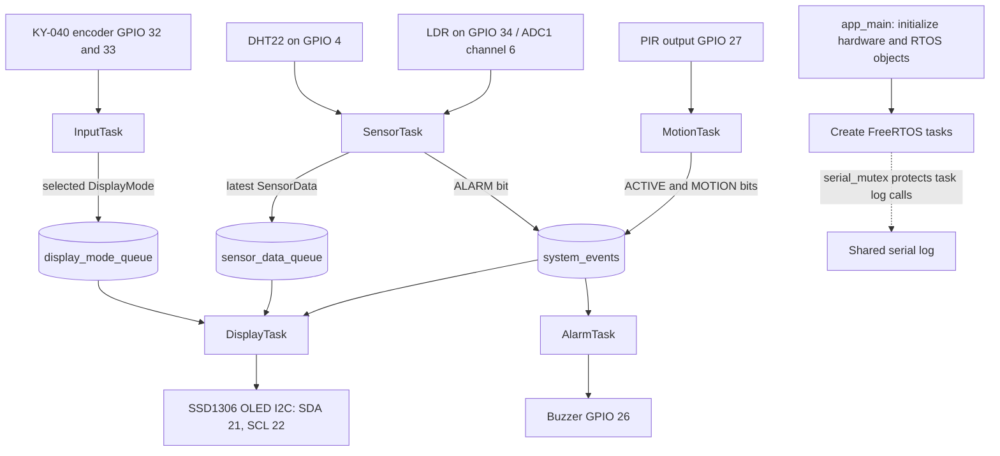
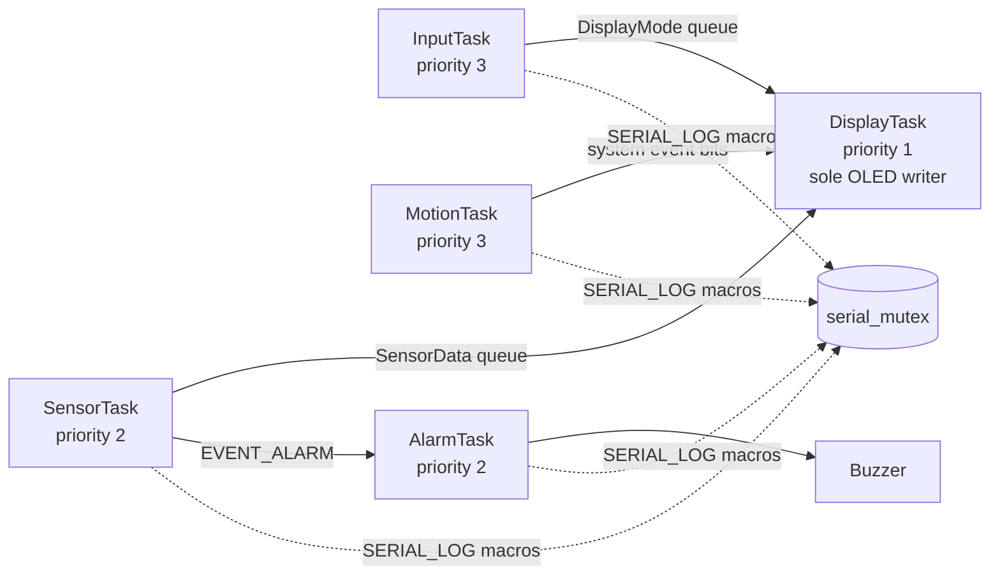
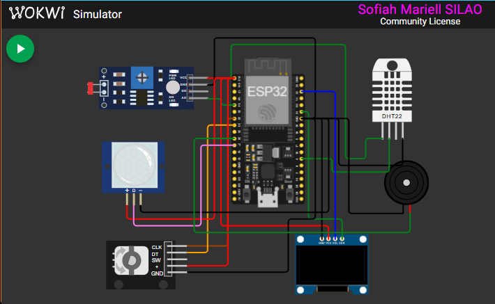
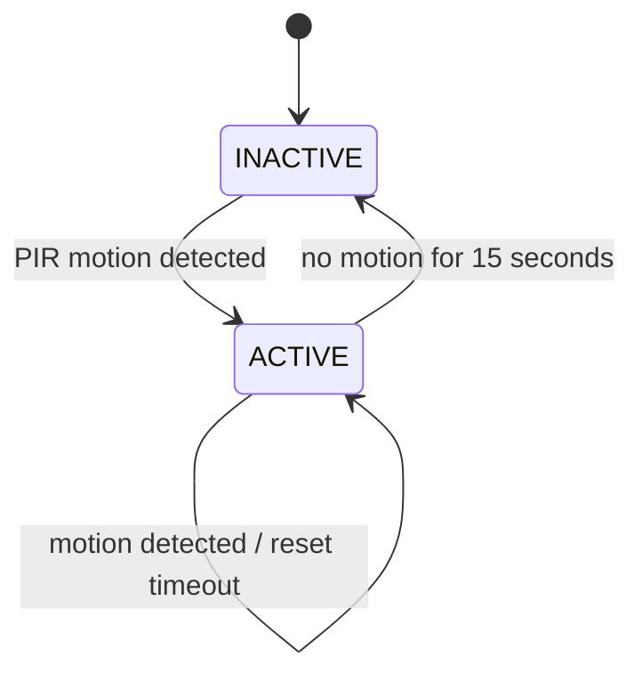
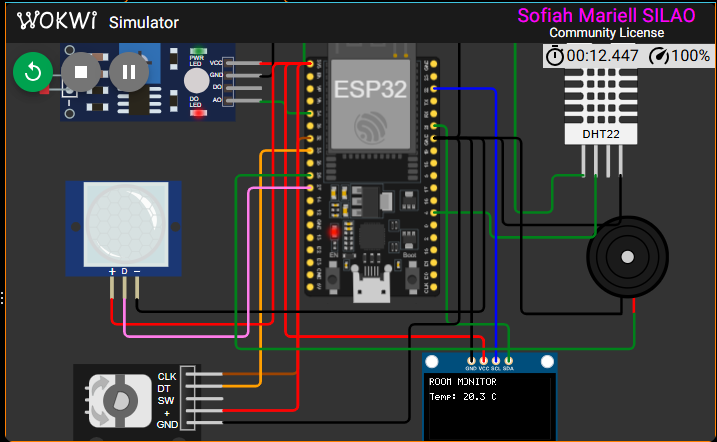

# BCA152 FreeRTOS Multisensor

## Project Overview

A simulated ESP32 room monitor built with PlatformIO, ESP-IDF, and FreeRTOS. It samples a DHT22 temperature/humidity sensor and a photoresistor, displays readings on an I2C OLED, accepts page selection from a rotary encoder, tracks occupancy with a PIR sensor, and drives a buzzer when temperature is outside the configured range.

The project was developed as a BCA152 laboratory activity. Wokwi provides the current hardware test environment; readings and behavior described here are for the simulation unless identified otherwise.

## Features

- Periodic DHT22 temperature and relative humidity acquisition.
- LDR analog sampling, shown as a normalized 0–100% ADC level.
- OLED pages for temperature, humidity, light level, and motion.
- Rotary encoder navigation with clockwise and counterclockwise wraparound.
- Temperature alarm output for readings below 18 °C or above 30 °C.
- PIR-based ACTIVE/INACTIVE system state with a 15-second inactivity timeout.
- FreeRTOS queues, event groups, and a mutex for shared task data and serial logging.
- Thirteen host-side unit tests for temperature decisions, page navigation, and system-state decisions.

## Learning Objectives

- Organize an ESP-IDF application into small C++ modules.
- Create FreeRTOS tasks with explicit priorities and blocking periods.
- Pass data safely between tasks using queues, event groups, and a mutex.
- Separate deterministic application decisions from hardware access so the decisions can be host-tested.
- Verify firmware behavior in Wokwi and inspect static-analysis findings.

## System Architecture

`app_main()` initializes the shared logging mutex, sensors, buzzer, queues, and event group, then starts the worker tasks. Each task owns one main responsibility; `DisplayTask` is the only task that writes to the OLED.



*Figure 1. Sensor inputs, task responsibilities, shared RTOS objects, and hardware outputs.*

## FreeRTOS Architecture

Tasks run independently under the FreeRTOS scheduler. The priorities below match the lab's suggested starting values. `SensorTask` samples every 2 seconds; `MotionTask` polls every 100 ms; `AlarmTask` checks the alarm bit every 100 ms. `InputTask` yields with a 1-tick delay and `DisplayTask` waits briefly for queue updates.



*Figure 2. FreeRTOS tasks and the queues, event group, and mutex they use to communicate.*

The ESP32 is dual-core capable. Task priority affects scheduling when tasks are ready on the same core; observed timing also depends on blocking, core affinity, and simulator scheduling.

## Hardware / Simulated Components

| Component | Role |
| --- | --- |
| ESP32 DevKit v1 | Runs the ESP-IDF and FreeRTOS application |
| DHT22 | Temperature and relative humidity |
| Photoresistor module (LDR) | Relative ADC level |
| SSD1306 128×64 OLED | Displays the selected reading or motion status |
| KY-040 rotary encoder | Selects the displayed page |
| PIR motion sensor | Activates the system and restarts the inactivity timer |
| Buzzer | Sounds when temperature is outside the normal range |

### Wokwi Circuit Image

The editable circuit definition is [diagram.json](diagram.json).



*Figure 4. Complete Wokwi circuit, including the ESP32, sensors, OLED, encoder, and buzzer wiring.*

## Pin Configuration

| Signal | ESP32 pin | Notes |
| --- | --- | --- |
| DHT22 data | GPIO 4 | Single-wire data interface |
| LDR analog output | GPIO 34 | ADC1 channel 6, 12-bit raw scale normalized to percent |
| OLED SDA | GPIO 21 | I2C address `0x3C` |
| OLED SCL | GPIO 22 | I2C |
| Encoder CLK | GPIO 32 | Internal pull-up enabled |
| Encoder DT | GPIO 33 | Internal pull-up enabled |
| PIR output | GPIO 27 | Pull-down enabled |
| Buzzer positive | GPIO 26 | 2 kHz LEDC PWM, 50% duty when active |
| Component power | 3V3 | Check the component's rated supply when using physical hardware |
| Common ground | GND | Shared reference for all modules |

## Task Design

| Task | Priority | Responsibility |
| --- | ---: | --- |
| `MotionTask` | 3 | Polls PIR input, updates motion and ACTIVE event bits, applies the inactivity timeout |
| `InputTask` | 3 | Reads encoder rotation and publishes the selected display page |
| `SensorTask` | 2 | Samples DHT22 and LDR every 2 seconds, updates alarm event and sensor queue |
| `AlarmTask` | 2 | Reads the alarm event and controls buzzer PWM |
| `DisplayTask` | 1 | Owns OLED setup and all OLED writes; displays sensor pages while system is ACTIVE |

## Inter-Task Communication

- `sensor_data_queue` holds one latest `SensorData` snapshot. `SensorTask` overwrites it; `DisplayTask` reads it.
- `display_mode_queue` holds one latest `DisplayMode`. `InputTask` overwrites it; `DisplayTask` reads it.
- `system_events` contains three bits: `EVENT_ACTIVE` and `EVENT_MOTION` are set/cleared by `MotionTask`; `EVENT_ALARM` is set/cleared by `SensorTask`. `DisplayTask` consumes ACTIVE state and the latest motion value; `AlarmTask` consumes ALARM state.
- `serial_mutex` wraps the shared `SERIAL_LOGI`, `SERIAL_LOGW`, and `SERIAL_LOGE` calls so tasks do not contend for the shared diagnostic output.

## State Machine

Motion makes the system ACTIVE immediately. If motion stops and the inactivity duration reaches 15 seconds, the system becomes INACTIVE. The PIR remains monitored in either state; new motion returns it to ACTIVE. The OLED is cleared on entry to INACTIVE and refreshed after activity resumes.



*Figure 3. Motion-driven system state transitions; the PIR remains monitored while inactive.*

The temperature alarm is a separate decision: readings below 18 °C produce `LOW_TEMPERATURE`, readings above 30 °C produce `HIGH_TEMPERATURE`, and values at either threshold or between them produce `NORMAL`.

## Repository Structure

```text
include/       Module interfaces and shared data/RTOS declarations
src/           ESP-IDF application modules and app_main
test/          Unity host-side unit tests
components/    Local ESP-IDF component area
diagram.json   Wokwi circuit definition
wokwi.toml     Wokwi firmware and ELF paths
platformio.ini PlatformIO ESP32 and native test environments
```

## Getting Started

Install [Visual Studio Code](https://code.visualstudio.com/), the PlatformIO IDE extension, and the Wokwi extension. Clone the repository and open its root folder in VS Code. PlatformIO installs the ESP32 platform and required build tools on the first build. The project uses ESP-IDF through PlatformIO and includes an ESP-IDF component dependency for the SSD1306 driver.

## Building the Project

From the project root, run:

```powershell
pio run -e esp32dev
```

The build output used by Wokwi is `.pio/build/esp32dev/firmware.bin`; the ELF file is `.pio/build/esp32dev/firmware.elf`.

## Running the Wokwi Simulation

Open `diagram.json` in Wokwi from the PlatformIO project, or use the Wokwi VS Code extension to start the simulation. Build the `esp32dev` environment first so the firmware binary exists. The DHT22 defaults in the circuit file to 25.4 °C and 61.2% RH; use component controls to exercise the sensor and inputs. Use the rotary encoder to change pages, the PIR control to trigger motion, and temperature settings to exercise the buzzer threshold.

## Unit Testing

Run the host-side Unity suite without ESP32 hardware:

```powershell
pio test -e native
```

The 13 tests cover five temperature threshold cases, four display-navigation transitions (including wraparound), and four system-state decisions (before timeout, at timeout, remaining inactive, and waking on motion).

## Static Code Analysis

Run PlatformIO checks with:

```powershell
pio check -e esp32dev
```

Inspect the reported findings and distinguish actionable issues from low-severity cross-module usage warnings. `check_skip_packages = yes` avoids scanning installed toolchain and package sources.

## Functional Verification

The lab's Wokwi verification covers sensor display updates (FT-01 to FT-03), clockwise and counterclockwise page selection (FT-04 and FT-05), alarm activation and clearing (FT-06 and FT-07), PIR activation, inactivity, and wake-up (FT-08 to FT-10). Record the actual stimulus, displayed/observed result, and PASS/FAIL in the lab verification record; retain screenshots as evidence. Observed numeric values depend on the settings selected in the simulator.

### Finished-System Screenshot



*Figure 5. Running Wokwi system displaying a temperature reading on the OLED.*

## Engineering Decisions

- The display task alone writes to the OLED, which avoids concurrent display access.
- Single-item queues keep the latest sensor sample and requested display page without building up stale UI work.
- Temperature and motion-state decisions are pure functions in `alarm_logic.cpp` and `system_state.cpp`, allowing native unit testing.
- The LDR value is explicitly a normalized ADC percentage, not calibrated illuminance in lux.
- The inactivity timeout is 15 seconds to make laboratory verification practical.
- The alarm threshold decision is separated from the LEDC buzzer driver.

## Limitations

- Current verification uses Wokwi simulation; physical sensor tolerances, wiring noise, and enclosure behavior have not been characterized here.
- LDR output is not calibrated to lux and its percentage depends on the simulated/module voltage-divider response.
- The DHT22 must be sampled slowly; the application uses a 2-second period and drops invalid sensor snapshots.
- PIR behavior and buzzer audibility in simulation do not establish real-world range or sound pressure.

## Future Improvements

- Add calibrated ADC-to-lux conversion for a specific LDR circuit.
- Add configurable thresholds and a documented alarm hysteresis policy.
- Add error counters and recovery behavior for sensor or display initialization failures.
- Measure task stack high-water marks and runtime behavior on physical ESP32 hardware.
- Add automated checks for hardware-interface error paths and broader functional scenarios.

## References and Acknowledgments

- Espressif [ESP-IDF Programming Guide](https://docs.espressif.com/projects/esp-idf/en/stable/esp32/).
- PlatformIO [ESP-IDF framework documentation](https://docs.platformio.org/en/latest/frameworks/espidf.html).
- Wokwi [ESP32 simulator](https://wokwi.com/).
- The SSD1306 ESP-IDF component is declared in `src/idf_component.yml`; its upstream metadata and license are included with the managed component.
- BCA152 Laboratory Activity 1 instructions provided for this project.
